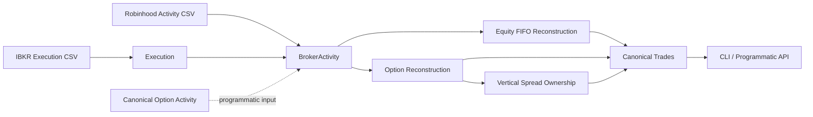

# Universal Trade Normalizer

**Universal Trade Normalizer converts inconsistent brokerage exports into deterministic logical
trades.**

Broker files describe account activity or individual executions. They do not directly describe the
positions and complete trade lifecycles people actually reason about. This local TypeScript engine
handles that stateful transformation:

```text
broker activity / executions → positions → logical trades → option strategies
```

It combines broker adapters, Decimal-safe accounting, FIFO lot reconstruction, stable identities,
and ambiguity-safe option ownership. Missing evidence stays missing: the engine does not invent
fees, timestamps, executions, or strategy intent.

## Quick start

Requirements: Node.js 22 or newer and pnpm 11.

```bash
pnpm install
pnpm build
pnpm cli normalize fixtures/robinhood/robinhood-equities-synthetic.csv --broker robinhood
```

The command uses committed synthetic data and prints canonical JSON without requiring a brokerage
account, environment variables, or network access. IBKR works through the same interface:

```bash
pnpm cli normalize fixtures/ibkr/ibkr-equities-executions-synthetic.csv --broker ibkr
```

An abridged canonical Trade looks like this. Financial values serialize as decimal strings:

```json
{
  "broker": "ibkr",
  "underlying": "AAPL",
  "assetType": "equity",
  "strategy": "equity_long",
  "status": "partially_closed",
  "grossRealizedPnl": "44.52"
}
```

## Supported inputs

| Broker profile                               | Equities | Options | Source evidence  |
| -------------------------------------------- | -------: | ------: | ---------------- |
| Robinhood supported account-activity profile |      Yes |      No | Account activity |
| IBKR UTN Trade Confirmation Execution CSV v1 |      Yes |      No | Execution-level  |

Broker selection is explicit; automatic detection is not enabled.

Robinhood input is date-level account activity, so its adapter emits canonical `BrokerActivity`
without pretending each row is a confirmed execution. The IBKR profile has execution-level
evidence, so each valid row emits a canonical `Execution` and one linked `BrokerActivity`.

IBKR Flex Query exports are customizable. This project intentionally supports one exact 24-column
profile rather than claiming arbitrary IBKR CSV compatibility. Current broker adapters import
equities only; the canonical engine's option capabilities are documented separately below.

## Engineering characteristics

- Exact Decimal arithmetic for quantities, prices, fees, and P&L
- Deterministic FIFO reconstruction, IDs, diagnostics, ordering, and JSON
- Runtime validation through canonical Zod schemas
- Conservative option ownership that reports ambiguity instead of guessing
- Local-only operation with no telemetry, credentials, database, or external services

## Architecture



Broker adapters stop at canonical evidence. The broker-independent core owns FIFO reconstruction,
option-contract state, vertical ownership, and Trade production. Current broker adapters produce
equity activity only; the option path begins with already normalized canonical option activity.

The package boundaries are:

```text
packages/
  schemas/                 Canonical Zod schemas and domain types
  core/                    Broker-independent reconstruction and Trade production
  adapters/
    robinhood/             Robinhood equity activity adapter
    ibkr/                  Fixed-profile IBKR equity execution adapter
    webull/                Private, unimplemented boundary placeholder
  cli/                     Commands and high-level normalization API
```

## Programmatic API

Normal consumers can use the high-level orchestration API without manually coordinating each core
stage:

```ts
import { normalizeBrokerSource } from '@trade-normalizer/cli';

const result = normalizeBrokerSource({
  source: csvText,
  sourceFile: 'trades.csv',
  broker: 'robinhood',
});

console.log(result.trades);
```

`normalizeBrokerFile` provides the asynchronous local-file equivalent. Advanced consumers can use
the lower-level schemas, adapters, reconstruction stages, and Trade builder directly.

## Reconstruction and strategy capabilities

The core supports these canonical strategy classifications:

- `equity_long`
- `long_call`
- `long_put`
- `short_call`
- `short_put`
- `bull_call_spread`
- `bear_call_spread`
- `bull_put_spread`
- `bear_put_spread`
- `unknown`

Equities use deterministic long-only FIFO lots, including fractional quantities, multiple entries,
partial closes, repeated lifecycles, and structured oversell diagnostics.

Options use exact contract identity—underlying, expiration, strike, call/put, and explicit
multiplier. Long and short positions reconstruct independently. Vertical-spread matching allocates
ownership conservatively and leaves partial or ambiguous ownership ungrouped rather than assigning
the same quantity twice.

These core option capabilities do not imply broker-imported option support. No current broker
adapter parses option rows.

## Correctness policies

- **Decimal arithmetic:** quantities, prices, strikes, fees, and P&L use `decimal.js`, not binary
  floating point.
- **Missing fees:** absent fee evidence remains unknown. Reported IBKR commission is preserved
  separately and is not assumed to be a complete fee breakdown.
- **Time precision:** date-only values remain dates. Timezone-less IBKR datetimes remain local
  execution evidence and are conservatively downgraded to date precision in logical Trades. No UTC
  offset is fabricated.
- **Determinism:** source ordering, FIFO allocation, identifiers, diagnostics, and JSON serialization
  are stable for the same evidence.
- **Ambiguity safety:** uncertain option ownership is reported rather than force-classified.
- **Source isolation:** broker-specific columns and meanings do not leak into core reconstruction.

## Local and private by design

The project runs locally. It has:

- no telemetry;
- no database;
- no market-data API calls;
- no credential handling;
- no hosted service; and
- no AI dependency.

Broker exports can still contain sensitive account and financial information. Never commit personal
exports or attach them to public bug reports. See [SECURITY.md](SECURITY.md) and
[CONTRIBUTING.md](CONTRIBUTING.md).

## Development

```bash
pnpm format
pnpm lint
pnpm typecheck
pnpm test
pnpm build
pnpm check
```

| Command              | Purpose                                                   |
| -------------------- | --------------------------------------------------------- |
| `pnpm audit:prod`    | Query the registry for production dependency advisories   |
| `pnpm build`         | Build TypeScript projects using project references        |
| `pnpm cli`           | Run the compiled CLI after building                       |
| `pnpm clean`         | Remove TypeScript build outputs                           |
| `pnpm format`        | Format supported files with Prettier                      |
| `pnpm format:check`  | Verify formatting                                         |
| `pnpm lint`          | Run ESLint with zero warnings allowed                     |
| `pnpm typecheck`     | Type-check the complete workspace without emitting files  |
| `pnpm test`          | Run the Vitest suite once                                 |
| `pnpm test:coverage` | Generate an all-source coverage report                    |
| `pnpm test:watch`    | Run Vitest in watch mode                                  |
| `pnpm check`         | Run formatting, linting, type-checking, tests, and builds |

Successful normalization writes no logs or ANSI formatting into stdout JSON. Operational errors
use stderr. Exit code `0` means success, including usable warning results; `1` means an operational
or validation failure; `2` means invalid command usage.

## Current limitations

- No broker-imported options
- No arbitrary IBKR Flex Query support
- No Webull implementation or broker auto-detection
- No exercise, assignment, or expiration lifecycle events
- No strategies beyond single options and vertical spreads
- No persistent cross-file deduplication
- No direct reconstruction from Execution objects; linked BrokerActivity remains the reconstruction
  input
- No market data, currency conversion, tax reporting, persistence, API server, or web UI

See [CHANGELOG.md](CHANGELOG.md) for the current unreleased capabilities. Contributions are welcome
under the [MIT License](LICENSE).
